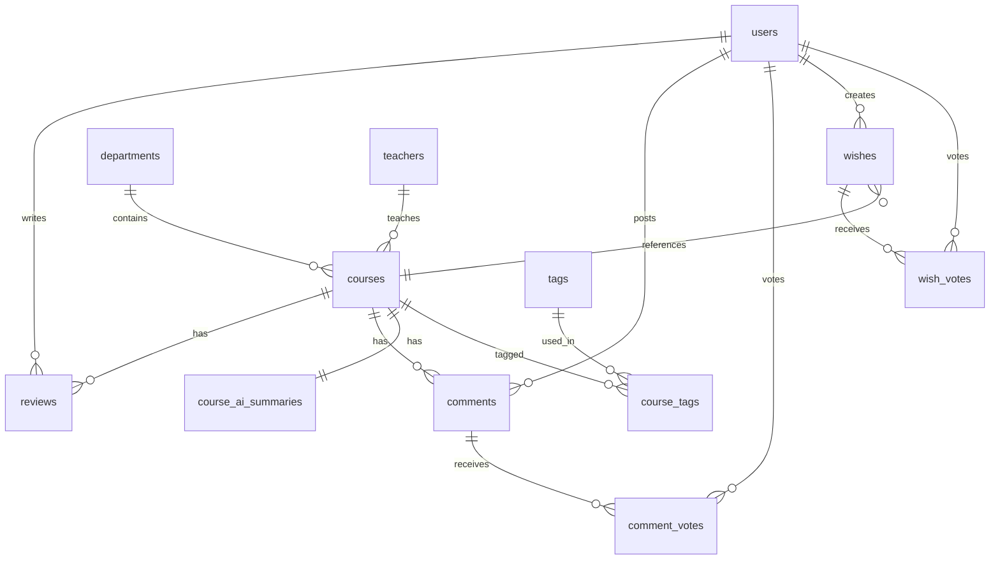

# NCU-TLDR PostgreSQL 資料庫設計書

## 1. 設計原則

| 原則 | 說明 |
|------|------|
| **命名** | 表名 snake_case 複數；欄位 snake_case；PK 統一 `id`；FK `{單數表名}_id` |
| **主鍵** | `users` 採 UUID（安全/分散式友善）；其餘表採 SERIAL/BIGSERIAL（詳見 §3 各表說明） |
| **時間** | 全部使用 `TIMESTAMPTZ`，統一 UTC |
| **軟刪除** | 需保留記錄的表使用 `is_deleted` 欄位 |
| **反正規化** | 高頻讀取的聚合值（平均星星、投票數）做 denormalized cache，由 application 或 trigger 更新 |
| **匿名留言** | 前端不暴露 `user_id`，DB 層保留 FK 供管理員追查 |
| **正規化** | `departments` 與 `teachers` 獨立成表，避免文字冗餘、確保一致性 |
| **可信度** | 用戶具備 `credibility_score`，影響星等權重、AI 摘要引用與留言排序 |

---

## 2. ER Diagram



---

## 3. Table Definitions

### 3.1 `users` — 用戶資料

> **PK 選型：UUID**
> - 用戶 ID 會出現在 JWT token、前端 URL、API response 等外部場景
> - UUID 不可被列舉或猜測，避免「把 id=1 改成 id=2 就能看到別人資料」的 IDOR 攻擊
> - 未來若需要多服務/多 DB 合併，UUID 天然全域唯一不衝突
> - 對用戶表而言 UUID 的儲存成本（16 bytes）相對於安全性收益可忽略

| Column | Type | Constraints | Description |
|--------|------|-------------|-------------|
| `id` | `UUID` | `PK DEFAULT gen_random_uuid()` | 用戶唯一識別碼 |
| `email` | `VARCHAR(255)` | `NOT NULL UNIQUE` | 電子郵件 |
| `password_hash` | `VARCHAR(255)` | | 密碼雜湊（OAuth 用戶可 NULL） |
| `display_name` | `VARCHAR(100)` | `NOT NULL` | 顯示名稱 |
| `guide_level` | `SMALLINT` | `NOT NULL DEFAULT 0` | 嚮導等級（gamification） |
| `credibility_score` | `NUMERIC(3,2)` | `NOT NULL DEFAULT 1.0` | 可信度權重（0.1~5.0，預設 1.0） |
| `avatar_url` | `TEXT` | | 頭像 URL |
| `total_reviews` | `INTEGER` | `NOT NULL DEFAULT 0` | 累計評價數（denormalized） |
| `total_comments` | `INTEGER` | `NOT NULL DEFAULT 0` | 累計留言數（denormalized） |
| `is_active` | `BOOLEAN` | `NOT NULL DEFAULT TRUE` | 帳號啟用狀態 |
| `created_at` | `TIMESTAMPTZ` | `NOT NULL DEFAULT now()` | 建立時間 |
| `updated_at` | `TIMESTAMPTZ` | `NOT NULL DEFAULT now()` | 更新時間 |

```sql
CREATE TABLE IF NOT EXISTS users (
    id                  UUID PRIMARY KEY DEFAULT gen_random_uuid(),
    email               VARCHAR(255) NOT NULL UNIQUE,
    password_hash       VARCHAR(255),
    display_name        VARCHAR(100) NOT NULL,
    guide_level         SMALLINT    NOT NULL DEFAULT 0,
    credibility_score   NUMERIC(3,2) NOT NULL DEFAULT 1.0 CHECK (credibility_score BETWEEN 0.1 AND 5.0),
    avatar_url          TEXT,
    total_reviews       INTEGER     NOT NULL DEFAULT 0,
    total_comments      INTEGER     NOT NULL DEFAULT 0,
    is_active           BOOLEAN     NOT NULL DEFAULT TRUE,
    created_at          TIMESTAMPTZ NOT NULL DEFAULT now(),
    updated_at          TIMESTAMPTZ NOT NULL DEFAULT now()
);
```

> **credibility_score**：動態計算的信任值。亂填星等/低品質評論會降低此值。影響力：
> 1. **星等加權**：計算課程 `avg_*` 時，乘以此權重。
> 2. **AI 摘要**：低分用戶的評論較不被 AI 採納。
> 3. **排序**：低分用戶的留言在「熱門」排序中權重較低。

---

### 3.2 `departments` — 系所

> **PK 選型：SERIAL**
> - 系所為系統內部參考資料，ID 不暴露於外部 URL 或 token
> - 總數有限（< 100），SERIAL 的 4-byte int 遠比 UUID 節省空間
> - 做為 FK 被 `courses` 大量引用，較小的 int 讓 JOIN 與 index 更高效

| Column | Type | Constraints | Description |
|--------|------|-------------|-------------|
| `id` | `SERIAL` | `PK` | 系所 ID |
| `name` | `VARCHAR(100)` | `NOT NULL UNIQUE` | 系所全名（e.g. 資訊工程學系） |
| `code` | `VARCHAR(20)` | `UNIQUE` | 系所代碼（e.g. CS, ME） |

```sql
CREATE TABLE IF NOT EXISTS departments (
    id   SERIAL PRIMARY KEY,
    name VARCHAR(100) NOT NULL UNIQUE,
    code VARCHAR(20)  UNIQUE
);
```

---

### 3.3 `teachers` — 教師

> **PK 選型：SERIAL**
> - 教師為內部參考資料，不需對外曝露
> - 相同教師可開設多門課，正規化後可避免文字不一致（如「王大明」vs「王 大明」）
> - 未來可擴展教師個人頁面、跨課程評價統計

| Column | Type | Constraints | Description |
|--------|------|-------------|-------------|
| `id` | `SERIAL` | `PK` | 教師 ID |
| `name` | `VARCHAR(100)` | `NOT NULL` | 教師姓名 |
| `department_id` | `INTEGER` | `FK → departments(id)` | 所屬系所（可 NULL = 外聘/通識） |

```sql
CREATE TABLE IF NOT EXISTS teachers (
    id              SERIAL PRIMARY KEY,
    name            VARCHAR(100) NOT NULL,
    department_id   INTEGER REFERENCES departments(id) ON DELETE SET NULL,

    CONSTRAINT uq_teachers_name_dept UNIQUE (name, department_id)
);
```

> **唯一約束**：`(name, department_id)` — 同系所不會有同名教師；不同系所可以有同名教師。

---

### 3.4 `courses` — 課程基本資訊

> **PK 選型：SERIAL**
> - 課程 ID 出現在 URL（`/courses/42`）但屬於公開資料，無安全顧慮
> - 做為全系統最高頻 JOIN 的表（reviews、comments、tags、AI summaries 都引用），4-byte int 的 index 效能遠優於 16-byte UUID
> - 課程數量在可預見範圍（< 數萬），SERIAL 足夠

| Column | Type | Constraints | Description |
|--------|------|-------------|-------------|
| `id` | `SERIAL` | `PK` | 課程唯一識別碼 |
| `department_id` | `INTEGER` | `NOT NULL FK → departments(id)` | 開課系所 |
| `teacher_id` | `INTEGER` | `NOT NULL FK → teachers(id)` | 授課教師 |
| `course_code` | `VARCHAR(20)` | `NOT NULL` | 課號（e.g. CS3001） |
| `name` | `VARCHAR(200)` | `NOT NULL` | 課程名稱 |
| `credits` | `SMALLINT` | `NOT NULL` | 學分數 |
| `course_type` | `VARCHAR(20)` | `NOT NULL` | 必修 / 選修 / 通識 |
| `schedule` | `VARCHAR(100)` | | 上課時間（e.g. 四234） |
| `last_offered_semester` | `VARCHAR(20)` | | 最後開課學期（e.g. 113-2） |
| `avg_reward` | `NUMERIC(3,2)` | `NOT NULL DEFAULT 0` | 收穫平均（加權後） |
| `avg_score` | `NUMERIC(3,2)` | `NOT NULL DEFAULT 0` | 分數平均（加權後） |
| `avg_easiness` | `NUMERIC(3,2)` | `NOT NULL DEFAULT 0` | 輕鬆平均（加權後） |
| `avg_teacher_style` | `NUMERIC(3,2)` | `NOT NULL DEFAULT 0` | 教師風格平均（加權後） |
| `avg_overall` | `NUMERIC(3,2)` | `NOT NULL DEFAULT 0` | 綜合平均（加權後） |
| `review_count` | `INTEGER` | `NOT NULL DEFAULT 0` | 評價總數（denormalized） |
| `created_at` | `TIMESTAMPTZ` | `NOT NULL DEFAULT now()` | 建立時間 |
| `updated_at` | `TIMESTAMPTZ` | `NOT NULL DEFAULT now()` | 更新時間 |

> **可信度加權平均公式**：
> `Sum(Rating * UserCredibility) / Sum(UserCredibility)`
> 避免惡意洗分用戶大幅影響課程分數。

```sql
CREATE TABLE IF NOT EXISTS courses (
    id                      SERIAL PRIMARY KEY,
    department_id           INTEGER      NOT NULL REFERENCES departments(id) ON DELETE RESTRICT,
    teacher_id              INTEGER      NOT NULL REFERENCES teachers(id)    ON DELETE RESTRICT,
    course_code             VARCHAR(20)  NOT NULL,
    name                    VARCHAR(200) NOT NULL,
    credits                 SMALLINT     NOT NULL,
    course_type             VARCHAR(20)  NOT NULL,
    schedule                VARCHAR(100),
    last_offered_semester   VARCHAR(20),
    avg_reward              NUMERIC(3,2) NOT NULL DEFAULT 0,
    avg_score               NUMERIC(3,2) NOT NULL DEFAULT 0,
    avg_easiness            NUMERIC(3,2) NOT NULL DEFAULT 0,
    avg_teacher_style       NUMERIC(3,2) NOT NULL DEFAULT 0,
    avg_overall             NUMERIC(3,2) NOT NULL DEFAULT 0,
    review_count            INTEGER      NOT NULL DEFAULT 0,
    created_at              TIMESTAMPTZ  NOT NULL DEFAULT now(),
    updated_at              TIMESTAMPTZ  NOT NULL DEFAULT now(),

    CONSTRAINT uq_courses_code_teacher UNIQUE (course_code, teacher_id)
);
```

> **唯一約束**：`(course_code, teacher_id)` — 同一課號 + 同一教師 = 同一門課頁面。
> **ON DELETE RESTRICT**：防止誤刪仍有課程引用的系所/教師。

---

### 3.5 `tags` — 標籤

> **PK 選型：SERIAL** — 標籤為輕量參考表，總數有限，只做 junction table 的 FK。

| Column | Type | Constraints | Description |
|--------|------|-------------|-------------|
| `id` | `SERIAL` | `PK` | 標籤 ID |
| `name` | `VARCHAR(50)` | `NOT NULL UNIQUE` | 標籤名稱（e.g. 作業多、高分） |

```sql
CREATE TABLE IF NOT EXISTS tags (
    id   SERIAL PRIMARY KEY,
    name VARCHAR(50) NOT NULL UNIQUE
);
```

---

### 3.6 `course_tags` — 課程標籤關聯（多對多）

> **PK 選型：複合主鍵 (course_id, tag_id)** — junction table 不需獨立 ID，複合鍵本身即可唯一識別並自帶防重複。

| Column | Type | Constraints | Description |
|--------|------|-------------|-------------|
| `course_id` | `INTEGER` | `FK → courses(id)` | 課程 ID |
| `tag_id` | `INTEGER` | `FK → tags(id)` | 標籤 ID |

```sql
CREATE TABLE IF NOT EXISTS course_tags (
    course_id INTEGER NOT NULL REFERENCES courses(id) ON DELETE CASCADE,
    tag_id    INTEGER NOT NULL REFERENCES tags(id)    ON DELETE CASCADE,
    PRIMARY KEY (course_id, tag_id)
);
```

---

### 3.7 `reviews` — 課程評價（星星評價 + 評價內容）

> **PK 選型：SERIAL**
> - 評價 ID 可出現在 URL（`/reviews/123`）但屬於公開資料
> - 評價數量中等（課程數 × 平均評價數），SERIAL 足夠
> - 大量被 JOIN 計算聚合分數，int 比 UUID 效能更佳

每位用戶對同一門課僅能提交一份評價（可更新）。

| Column | Type | Constraints | Description |
|--------|------|-------------|-------------|
| `id` | `SERIAL` | `PK` | 評價 ID |
| `course_id` | `INTEGER` | `NOT NULL FK → courses(id)` | 課程 ID |
| `user_id` | `UUID` | `NOT NULL FK → users(id)` | 評價者 ID |
| `rating_reward` | `SMALLINT` | `NOT NULL CHECK(1~5)` | 收穫評分 |
| `rating_score` | `SMALLINT` | `NOT NULL CHECK(1~5)` | 分數評分 |
| `rating_easiness` | `SMALLINT` | `NOT NULL CHECK(1~5)` | 輕鬆程度評分 |
| `rating_teacher_style` | `SMALLINT` | `NOT NULL CHECK(1~5)` | 教師風格評分 |
| `overview` | `TEXT` | | 課程概述 |
| `target_audience` | `TEXT` | | 適合族群 |
| `textbook` | `VARCHAR(500)` | | 上課用書 |
| `prerequisites` | `VARCHAR(500)` | | 建議先備知識 |
| `weekly_hours` | `VARCHAR(50)` | | 每週額外投入時間 |
| `grading` | `JSONB` | | 評分方式 `[{label, percentage}]` |
| `notes` | `TEXT` | | 常見雷點或注意事項 |
| `semester` | `VARCHAR(20)` | `NOT NULL` | 修課學期（e.g. 113-1） |
| `created_at` | `TIMESTAMPTZ` | `NOT NULL DEFAULT now()` | 建立時間 |
| `updated_at` | `TIMESTAMPTZ` | `NOT NULL DEFAULT now()` | 更新時間 |

```sql
CREATE TABLE IF NOT EXISTS reviews (
    id                      SERIAL PRIMARY KEY,
    course_id               INTEGER     NOT NULL REFERENCES courses(id) ON DELETE CASCADE,
    user_id                 UUID        NOT NULL REFERENCES users(id)   ON DELETE CASCADE,
    rating_reward           SMALLINT    NOT NULL CHECK (rating_reward BETWEEN 1 AND 5),
    rating_score            SMALLINT    NOT NULL CHECK (rating_score BETWEEN 1 AND 5),
    rating_easiness         SMALLINT    NOT NULL CHECK (rating_easiness BETWEEN 1 AND 5),
    rating_teacher_style    SMALLINT    NOT NULL CHECK (rating_teacher_style BETWEEN 1 AND 5),
    overview                TEXT,
    target_audience         TEXT,
    textbook                VARCHAR(500),
    prerequisites           VARCHAR(500),
    weekly_hours            VARCHAR(50),
    grading                 JSONB,
    notes                   TEXT,
    semester                VARCHAR(20) NOT NULL,
    created_at              TIMESTAMPTZ NOT NULL DEFAULT now(),
    updated_at              TIMESTAMPTZ NOT NULL DEFAULT now(),

    CONSTRAINT uq_reviews_course_user UNIQUE (course_id, user_id)
);
```

> **grading JSONB 範例**：`[{"label": "作業", "percentage": 40}, {"label": "期中", "percentage": 30}, {"label": "期末", "percentage": 30}]`

---

### 3.8 `course_ai_summaries` — AI 統整摘要

> **PK 選型：SERIAL** — 與 courses 1:1，ID 僅供內部識別，不對外暴露。

每門課程一筆，由後端排程 / 手動觸發根據所有 reviews 彙整產生。 **AI 統整時會優先採用高可信度用戶（credibility_score 高）的評價內容。**

| Column | Type | Constraints | Description |
|--------|------|-------------|-------------|
| `id` | `SERIAL` | `PK` | 摘要 ID |
| `course_id` | `INTEGER` | `NOT NULL UNIQUE FK → courses(id)` | 課程 ID（1:1） |
| `tags` | `TEXT[]` | | AI 產生的標籤陣列 |
| `overview` | `TEXT` | | 課程概述 |
| `target_audience` | `TEXT` | | 適合族群 |
| `textbook` | `VARCHAR(500)` | | 上課用書 |
| `prerequisites` | `VARCHAR(500)` | | 建議先備知識 |
| `weekly_hours` | `VARCHAR(50)` | | 平均每週額外投入時間 |
| `grading` | `JSONB` | | 統整後的評分方式 |
| `notes` | `TEXT` | | 常見雷點或注意事項 |
| `source_review_count` | `INTEGER` | `NOT NULL DEFAULT 0` | 統整所參考的評價數量 |
| `generated_at` | `TIMESTAMPTZ` | `NOT NULL DEFAULT now()` | 產生時間 |
| `updated_at` | `TIMESTAMPTZ` | `NOT NULL DEFAULT now()` | 更新時間 |

```sql
CREATE TABLE IF NOT EXISTS course_ai_summaries (
    id                      SERIAL PRIMARY KEY,
    course_id               INTEGER      NOT NULL UNIQUE REFERENCES courses(id) ON DELETE CASCADE,
    tags                    TEXT[],
    overview                TEXT,
    target_audience         TEXT,
    textbook                VARCHAR(500),
    prerequisites           VARCHAR(500),
    weekly_hours            VARCHAR(50),
    grading                 JSONB,
    notes                   TEXT,
    source_review_count     INTEGER      NOT NULL DEFAULT 0,
    generated_at            TIMESTAMPTZ  NOT NULL DEFAULT now(),
    updated_at              TIMESTAMPTZ  NOT NULL DEFAULT now()
);
```

---

### 3.9 `comments` — 匿名留言串

> **PK 選型：SERIAL** — 留言 ID 出現在前端但為公開資料，無安全風險；被 comment_votes 大量引用，int 效能較佳。

前端顯示匿名（如「匿名#A3F2」），DB 保留 `user_id` 供管理員追查真實身分。

| Column | Type | Constraints | Description |
|--------|------|-------------|-------------|
| `id` | `SERIAL` | `PK` | 留言 ID |
| `course_id` | `INTEGER` | `NOT NULL FK → courses(id)` | 所屬課程 |
| `user_id` | `UUID` | `NOT NULL FK → users(id)` | 發文者（不公開顯示） |
| `parent_id` | `INTEGER` | `FK → comments(id)` | 回覆對象（NULL = 頂層留言） |
| `title` | `VARCHAR(200)` | | 留言標題 / 一句話摘要 |
| `content` | `TEXT` | `NOT NULL` | 留言內文 |
| `likes` | `INTEGER` | `NOT NULL DEFAULT 0` | 讚數（denormalized） |
| `dislikes` | `INTEGER` | `NOT NULL DEFAULT 0` | 倒讚數（denormalized） |
| `is_deleted` | `BOOLEAN` | `NOT NULL DEFAULT FALSE` | 軟刪除標記 |
| `created_at` | `TIMESTAMPTZ` | `NOT NULL DEFAULT now()` | 發文時間 |
| `updated_at` | `TIMESTAMPTZ` | `NOT NULL DEFAULT now()` | 更新時間 |

```sql
CREATE TABLE IF NOT EXISTS comments (
    id          SERIAL PRIMARY KEY,
    course_id   INTEGER     NOT NULL REFERENCES courses(id)  ON DELETE CASCADE,
    user_id     UUID        NOT NULL REFERENCES users(id)    ON DELETE RESTRICT,
    parent_id   INTEGER              REFERENCES comments(id) ON DELETE CASCADE,
    title       VARCHAR(200),
    content     TEXT        NOT NULL,
    likes       INTEGER     NOT NULL DEFAULT 0,
    dislikes    INTEGER     NOT NULL DEFAULT 0,
    is_deleted  BOOLEAN     NOT NULL DEFAULT FALSE,
    created_at  TIMESTAMPTZ NOT NULL DEFAULT now(),
    updated_at  TIMESTAMPTZ NOT NULL DEFAULT now()
);
```

> **`ON DELETE RESTRICT`**：刪除用戶前必須先處理其留言（保障可追查性）。

---

### 3.10 `comment_votes` — 留言投票紀錄

> **PK 選型：複合主鍵 (user_id, comment_id)** — 天然唯一、防重複投票、不需額外 surrogate key。

| Column | Type | Constraints | Description |
|--------|------|-------------|-------------|
| `user_id` | `UUID` | `FK → users(id)` | 投票者 |
| `comment_id` | `INTEGER` | `FK → comments(id)` | 被投票的留言 |
| `vote_type` | `SMALLINT` | `NOT NULL CHECK(1 or -1)` | 1 = 讚、-1 = 倒讚 |
| `created_at` | `TIMESTAMPTZ` | `NOT NULL DEFAULT now()` | 投票時間 |

```sql
CREATE TABLE IF NOT EXISTS comment_votes (
    user_id     UUID        NOT NULL REFERENCES users(id)    ON DELETE CASCADE,
    comment_id  INTEGER     NOT NULL REFERENCES comments(id) ON DELETE CASCADE,
    vote_type   SMALLINT    NOT NULL CHECK (vote_type IN (1, -1)),
    created_at  TIMESTAMPTZ NOT NULL DEFAULT now(),

    PRIMARY KEY (user_id, comment_id)
);
```

---

### 3.11 `wishes` — 許願池

> **PK 選型：SERIAL** — 許願數量有限，ID 僅供內部排序與引用。

| Column | Type | Constraints | Description |
|--------|------|-------------|-------------|
| `id` | `SERIAL` | `PK` | 許願 ID |
| `course_id` | `INTEGER` | `FK → courses(id)` | 關聯課程（可 NULL，課程尚不存在時） |
| `course_name` | `VARCHAR(200)` | `NOT NULL` | 課程名稱（冗餘，許願時填寫） |
| `teacher` | `VARCHAR(100)` | `NOT NULL` | 教師名稱 |
| `vote_count` | `INTEGER` | `NOT NULL DEFAULT 0` | 票數（denormalized） |
| `created_by` | `UUID` | `NOT NULL FK → users(id)` | 發起人 |
| `created_at` | `TIMESTAMPTZ` | `NOT NULL DEFAULT now()` | 建立時間 |

```sql
CREATE TABLE IF NOT EXISTS wishes (
    id              SERIAL PRIMARY KEY,
    course_id       INTEGER              REFERENCES courses(id) ON DELETE SET NULL,
    course_name     VARCHAR(200) NOT NULL,
    teacher         VARCHAR(100) NOT NULL,
    vote_count      INTEGER      NOT NULL DEFAULT 0,
    created_by      UUID         NOT NULL REFERENCES users(id) ON DELETE CASCADE,
    created_at      TIMESTAMPTZ  NOT NULL DEFAULT now(),

    CONSTRAINT uq_wishes_name_teacher UNIQUE (course_name, teacher)
);
```

> **wishes.teacher 不使用 teacher_id FK**：許願的課程/教師可能尚不存在於系統中，因此用純文字欄位。

---

### 3.12 `wish_votes` — 許願投票紀錄

> **PK 選型：複合主鍵 (user_id, wish_id)** — 同 comment_votes 邏輯。

| Column | Type | Constraints | Description |
|--------|------|-------------|-------------|
| `user_id` | `UUID` | `FK → users(id)` | 投票者 |
| `wish_id` | `INTEGER` | `FK → wishes(id)` | 被投票的許願 |
| `created_at` | `TIMESTAMPTZ` | `NOT NULL DEFAULT now()` | 投票時間 |

```sql
CREATE TABLE IF NOT EXISTS wish_votes (
    user_id     UUID        NOT NULL REFERENCES users(id)  ON DELETE CASCADE,
    wish_id     INTEGER     NOT NULL REFERENCES wishes(id) ON DELETE CASCADE,
    created_at  TIMESTAMPTZ NOT NULL DEFAULT now(),

    PRIMARY KEY (user_id, wish_id)
);
```

---

## 4. PK 選型總覽

| 表 | PK 類型 | 理由 |
|----|---------|------|
| `users` | **UUID** | 外洩於 token/API，防 IDOR 攻擊；未來多服務合併無衝突 |
| `departments` | **SERIAL** | 內部參考，數量極少（< 100），省空間 |
| `teachers` | **SERIAL** | 內部參考，被 courses 大量 FK 引用，int JOIN 更快 |
| `courses` | **SERIAL** | 全系統最高頻 JOIN 的表，4-byte int index 效能關鍵 |
| `tags` | **SERIAL** | 輕量參考表，數量有限 |
| `course_tags` | **複合 PK** | junction table，天然唯一、自帶防重複 |
| `reviews` | **SERIAL** | 被聚合計算引用，int 效能佳；公開資料無安全風險 |
| `course_ai_summaries` | **SERIAL** | 與 courses 1:1，僅內部識別 |
| `comments` | **SERIAL** | 被 comment_votes 大量引用，int 效能佳 |
| `comment_votes` | **複合 PK** | 天然唯一、防重複投票 |
| `wishes` | **SERIAL** | 數量有限，僅供內部排序 |
| `wish_votes` | **複合 PK** | 天然唯一、防重複投票 |

---

## 5. Indexes

```sql
-- === users ===
-- email UNIQUE → 自動 unique index

-- === departments ===
-- name UNIQUE → 自動 unique index

-- === teachers ===
CREATE INDEX IF NOT EXISTS idx_teachers_name          ON teachers (name);
CREATE INDEX IF NOT EXISTS idx_teachers_department    ON teachers (department_id);

-- === courses ===
CREATE INDEX IF NOT EXISTS idx_courses_department     ON courses (department_id);
CREATE INDEX IF NOT EXISTS idx_courses_teacher        ON courses (teacher_id);
CREATE INDEX IF NOT EXISTS idx_courses_name           ON courses (name);
CREATE INDEX IF NOT EXISTS idx_courses_avg_overall    ON courses (avg_overall DESC);
-- 全文搜尋（需 JOIN teachers/departments，或用 materialized view）
-- 簡化版：僅對 course name 做 GIN
CREATE INDEX IF NOT EXISTS idx_courses_name_fulltext  ON courses USING GIN (
    to_tsvector('simple', name)
);

-- === course_tags ===
CREATE INDEX IF NOT EXISTS idx_course_tags_tag_id     ON course_tags (tag_id);

-- === reviews ===
CREATE INDEX IF NOT EXISTS idx_reviews_course_id      ON reviews (course_id);
CREATE INDEX IF NOT EXISTS idx_reviews_user_id        ON reviews (user_id);
CREATE INDEX IF NOT EXISTS idx_reviews_semester       ON reviews (semester);

-- === course_ai_summaries ===
-- course_id UNIQUE → 自動 unique index
CREATE INDEX IF NOT EXISTS idx_ai_summaries_tags      ON course_ai_summaries USING GIN (tags);

-- === comments ===
CREATE INDEX IF NOT EXISTS idx_comments_course_id     ON comments (course_id, created_at DESC);
CREATE INDEX IF NOT EXISTS idx_comments_user_id       ON comments (user_id);
CREATE INDEX IF NOT EXISTS idx_comments_parent_id     ON comments (parent_id);

-- === comment_votes ===
CREATE INDEX IF NOT EXISTS idx_comment_votes_comment  ON comment_votes (comment_id);

-- === wishes ===
CREATE INDEX IF NOT EXISTS idx_wishes_vote_count      ON wishes (vote_count DESC);
CREATE INDEX IF NOT EXISTS idx_wishes_course_id       ON wishes (course_id);

-- === wish_votes ===
CREATE INDEX IF NOT EXISTS idx_wish_votes_wish        ON wish_votes (wish_id);
```

---

## 6. 聚合值更新策略（Denormalization & Credibility）

以下欄位為反正規化快取，需在資料異動時同步更新：

| 目標表.欄位 | 觸發條件 | 更新邏輯 |
|-------------|----------|----------|
| `courses.avg_*` / `avg_overall` | `reviews` or `users.credibility_score` update | **加權平均**：`Sum(Rating × UserCredibility) / Sum(UserCredibility)` |
| `courses.review_count` | `reviews` INSERT / DELETE | `COUNT(*)` 該課程所有 reviews |
| `comments.likes` / `dislikes` | `comment_votes` INSERT / UPDATE / DELETE | `COUNT(*)` 依類別統計 |
| `wishes.vote_count` | `wish_votes` INSERT / DELETE | `COUNT(*)` 該 wish 的所有 votes |
| `users.total_reviews` | `reviews` INSERT / DELETE | `COUNT(*)` 該 user 的所有 reviews |
| `users.total_comments` | `comments` INSERT / DELETE | `COUNT(*)` 該 user 的所有 comments |

> **Credibility Impact**:
> - **AI 摘要**：AI 生成摘要時，輸入的 prompt 會根據 `user.credibility_score` 對 review 進行篩選或排序，優先採用高可信度評論。
> - **Hashtag**：`courses.tags` 的生成與計數同樣受可信度加權影響，避免惡意洗標籤。
> - **留言排序**：`comments` 在 API 列表回傳時，預設排序分數 = `(likes - dislikes) * user.credibility_score`，使高可信度用戶的發言更容易被看見。

> **建議**：初期用 application-level 更新；上線後若效能瓶頸再改用 PostgreSQL trigger。

---

## 7. 關鍵查詢場景與 Index 對應

| 場景 | 查詢 | 使用的 Index |
|------|------|-------------|
| 首頁搜尋課程 | `WHERE to_tsvector('simple', name) @@ to_tsquery(?)` | `idx_courses_name_fulltext` |
| 課程列表（依綜合評分排序） | `ORDER BY avg_overall DESC` | `idx_courses_avg_overall` |
| 依系所篩選 | `WHERE department_id = ?` | `idx_courses_department` |
| 依教師篩選 | `WHERE teacher_id = ?` | `idx_courses_teacher` |
| 依標籤篩選 | `JOIN course_tags WHERE tag_id = ?` | `course_tags PK` + `idx_course_tags_tag_id` |
| 課程詳情 — 載入評價 | `WHERE course_id = ? ORDER BY created_at` | `idx_reviews_course_id` |
| 課程詳情 — 載入留言 | `WHERE course_id = ? ORDER BY created_at DESC` | `idx_comments_course_id` |
| 許願池排行 | `ORDER BY vote_count DESC` | `idx_wishes_vote_count` |
| 我的評價 | `WHERE user_id = ?` | `idx_reviews_user_id` |
| AI 摘要標籤搜尋 | `WHERE tags @> ARRAY[?]` | `idx_ai_summaries_tags` |

---

## 8. 表關聯總覽

```
departments
 └── 1:N → courses      (department_id)
     └── 1:N ← teachers (department_id)  ← 教師也歸屬系所

teachers
 └── 1:N → courses      (teacher_id)

users
 ├── 1:N → reviews         (user_id)
 ├── 1:N → comments        (user_id)      ← 匿名但可追查
 ├── 1:N → comment_votes   (user_id)
 ├── 1:N → wishes          (created_by)
 └── 1:N → wish_votes      (user_id)

courses
 ├── N:1 → departments     (department_id)
 ├── N:1 → teachers        (teacher_id)
 ├── 1:N → reviews         (course_id)
 ├── 1:N → comments        (course_id)
 ├── 1:1 → course_ai_summaries (course_id)
 ├── M:N → tags            via course_tags
 └── 1:N ← wishes          (course_id, nullable)

comments
 ├── self → comments       (parent_id)    ← 巢狀回覆
 └── 1:N → comment_votes   (comment_id)

wishes
 └── 1:N → wish_votes      (wish_id)
```

---

## 9. 安全 & 匿名設計

### 匿名留言機制

```
┌──────────────────────────────────────────────────┐
│  前端顯示                                         │
│  ┌────────────────────────────┐                   │
│  │ 👤 匿名#A3F2：老師教得很好  │   ← 匿名 hash    │
│  └────────────────────────────┘                   │
│                                                   │
│  後端 / 資料庫                                     │
│  ┌────────────────────────────────────────────┐   │
│  │ user_id = "550e8400-..."                   │   │
│  │ → users.email = "student@ncu.edu.tw"       │   │
│  └────────────────────────────────────────────┘   │
│  管理員可透過 user_id JOIN users 查出真實身分       │
└──────────────────────────────────────────────────┘
```

- **匿名 hash 產生**：`匿名#` + `SHA256(user_id + course_id + salt).substring(0, 4).toUpperCase()`
- 同一用戶在同一課程下的匿名 hash 相同（可辨識同一人的多則留言）
- 不同課程下 hash 不同（跨課程無法關聯）

---

## 10. 未來擴展考量

| 項目 | 說明 |
|------|------|
| **課程開課紀錄** | 新增 `course_offerings(course_id, semester, schedule)` 追蹤逐學期開課紀錄 |
| **通知系統** | 新增 `notifications` 表，追蹤留言回覆、投票通知 |
| **檢舉機制** | 新增 `reports(target_type, target_id, reporter_id, reason)` 表 |
| **評價可信度權重** | `users` 新增 `credibility_score`，用於加權平均星星評價 |

---

## 11. 完整 DDL 彙總

<details>
<summary>點擊展開完整 SQL</summary>

```sql
-- ============================================================
-- NCU-TLDR Database Schema
-- PostgreSQL 15+
-- ============================================================

-- 1. users
CREATE TABLE IF NOT EXISTS users (
    id                  UUID PRIMARY KEY DEFAULT gen_random_uuid(),
    email               VARCHAR(255) NOT NULL UNIQUE,
    password_hash       VARCHAR(255),
    display_name        VARCHAR(100) NOT NULL,
    guide_level         SMALLINT    NOT NULL DEFAULT 0,
    credibility_score   NUMERIC(3,2) NOT NULL DEFAULT 1.0 CHECK (credibility_score BETWEEN 0.1 AND 5.0),
    avatar_url          TEXT,
    total_reviews       INTEGER     NOT NULL DEFAULT 0,
    total_comments      INTEGER     NOT NULL DEFAULT 0,
    is_active           BOOLEAN     NOT NULL DEFAULT TRUE,
    created_at          TIMESTAMPTZ NOT NULL DEFAULT now(),
    updated_at          TIMESTAMPTZ NOT NULL DEFAULT now()
);

-- 2. departments
CREATE TABLE IF NOT EXISTS departments (
    id   SERIAL PRIMARY KEY,
    name VARCHAR(100) NOT NULL UNIQUE,
    code VARCHAR(20)  UNIQUE
);

-- 3. teachers
CREATE TABLE IF NOT EXISTS teachers (
    id              SERIAL PRIMARY KEY,
    name            VARCHAR(100) NOT NULL,
    department_id   INTEGER REFERENCES departments(id) ON DELETE SET NULL,

    CONSTRAINT uq_teachers_name_dept UNIQUE (name, department_id)
);

-- 4. courses
CREATE TABLE IF NOT EXISTS courses (
    id                      SERIAL PRIMARY KEY,
    department_id           INTEGER      NOT NULL REFERENCES departments(id) ON DELETE RESTRICT,
    teacher_id              INTEGER      NOT NULL REFERENCES teachers(id)    ON DELETE RESTRICT,
    course_code             VARCHAR(20)  NOT NULL,
    name                    VARCHAR(200) NOT NULL,
    credits                 SMALLINT     NOT NULL,
    course_type             VARCHAR(20)  NOT NULL,
    schedule                VARCHAR(100),
    last_offered_semester   VARCHAR(20),
    avg_reward              NUMERIC(3,2) NOT NULL DEFAULT 0,
    avg_score               NUMERIC(3,2) NOT NULL DEFAULT 0,
    avg_easiness            NUMERIC(3,2) NOT NULL DEFAULT 0,
    avg_teacher_style       NUMERIC(3,2) NOT NULL DEFAULT 0,
    avg_overall             NUMERIC(3,2) NOT NULL DEFAULT 0,
    review_count            INTEGER      NOT NULL DEFAULT 0,
    created_at              TIMESTAMPTZ  NOT NULL DEFAULT now(),
    updated_at              TIMESTAMPTZ  NOT NULL DEFAULT now(),

    CONSTRAINT uq_courses_code_teacher UNIQUE (course_code, teacher_id)
);

-- 5. tags
CREATE TABLE IF NOT EXISTS tags (
    id   SERIAL PRIMARY KEY,
    name VARCHAR(50) NOT NULL UNIQUE
);

-- 6. course_tags
CREATE TABLE IF NOT EXISTS course_tags (
    course_id INTEGER NOT NULL REFERENCES courses(id) ON DELETE CASCADE,
    tag_id    INTEGER NOT NULL REFERENCES tags(id)    ON DELETE CASCADE,
    PRIMARY KEY (course_id, tag_id)
);

-- 7. reviews
CREATE TABLE IF NOT EXISTS reviews (
    id                      SERIAL PRIMARY KEY,
    course_id               INTEGER     NOT NULL REFERENCES courses(id) ON DELETE CASCADE,
    user_id                 UUID        NOT NULL REFERENCES users(id)   ON DELETE CASCADE,
    rating_reward           SMALLINT    NOT NULL CHECK (rating_reward BETWEEN 1 AND 5),
    rating_score            SMALLINT    NOT NULL CHECK (rating_score BETWEEN 1 AND 5),
    rating_easiness         SMALLINT    NOT NULL CHECK (rating_easiness BETWEEN 1 AND 5),
    rating_teacher_style    SMALLINT    NOT NULL CHECK (rating_teacher_style BETWEEN 1 AND 5),
    overview                TEXT,
    target_audience         TEXT,
    textbook                VARCHAR(500),
    prerequisites           VARCHAR(500),
    weekly_hours            VARCHAR(50),
    grading                 JSONB,
    notes                   TEXT,
    semester                VARCHAR(20) NOT NULL,
    created_at              TIMESTAMPTZ NOT NULL DEFAULT now(),
    updated_at              TIMESTAMPTZ NOT NULL DEFAULT now(),

    CONSTRAINT uq_reviews_course_user UNIQUE (course_id, user_id)
);

-- 8. course_ai_summaries
CREATE TABLE IF NOT EXISTS course_ai_summaries (
    id                      SERIAL PRIMARY KEY,
    course_id               INTEGER      NOT NULL UNIQUE REFERENCES courses(id) ON DELETE CASCADE,
    tags                    TEXT[],
    overview                TEXT,
    target_audience         TEXT,
    textbook                VARCHAR(500),
    prerequisites           VARCHAR(500),
    weekly_hours            VARCHAR(50),
    grading                 JSONB,
    notes                   TEXT,
    source_review_count     INTEGER      NOT NULL DEFAULT 0,
    generated_at            TIMESTAMPTZ  NOT NULL DEFAULT now(),
    updated_at              TIMESTAMPTZ  NOT NULL DEFAULT now()
);

-- 9. comments
CREATE TABLE IF NOT EXISTS comments (
    id          SERIAL PRIMARY KEY,
    course_id   INTEGER     NOT NULL REFERENCES courses(id)  ON DELETE CASCADE,
    user_id     UUID        NOT NULL REFERENCES users(id)    ON DELETE RESTRICT,
    parent_id   INTEGER              REFERENCES comments(id) ON DELETE CASCADE,
    title       VARCHAR(200),
    content     TEXT        NOT NULL,
    likes       INTEGER     NOT NULL DEFAULT 0,
    dislikes    INTEGER     NOT NULL DEFAULT 0,
    is_deleted  BOOLEAN     NOT NULL DEFAULT FALSE,
    created_at  TIMESTAMPTZ NOT NULL DEFAULT now(),
    updated_at  TIMESTAMPTZ NOT NULL DEFAULT now()
);

-- 10. comment_votes
CREATE TABLE IF NOT EXISTS comment_votes (
    user_id     UUID        NOT NULL REFERENCES users(id)    ON DELETE CASCADE,
    comment_id  INTEGER     NOT NULL REFERENCES comments(id) ON DELETE CASCADE,
    vote_type   SMALLINT    NOT NULL CHECK (vote_type IN (1, -1)),
    created_at  TIMESTAMPTZ NOT NULL DEFAULT now(),

    PRIMARY KEY (user_id, comment_id)
);

-- 11. wishes
CREATE TABLE IF NOT EXISTS wishes (
    id              SERIAL PRIMARY KEY,
    course_id       INTEGER              REFERENCES courses(id) ON DELETE SET NULL,
    course_name     VARCHAR(200) NOT NULL,
    teacher         VARCHAR(100) NOT NULL,
    vote_count      INTEGER      NOT NULL DEFAULT 0,
    created_by      UUID         NOT NULL REFERENCES users(id) ON DELETE CASCADE,
    created_at      TIMESTAMPTZ  NOT NULL DEFAULT now(),

    CONSTRAINT uq_wishes_name_teacher UNIQUE (course_name, teacher)
);

-- 12. wish_votes
CREATE TABLE IF NOT EXISTS wish_votes (
    user_id     UUID        NOT NULL REFERENCES users(id)  ON DELETE CASCADE,
    wish_id     INTEGER     NOT NULL REFERENCES wishes(id) ON DELETE CASCADE,
    created_at  TIMESTAMPTZ NOT NULL DEFAULT now(),

    PRIMARY KEY (user_id, wish_id)
);

-- ============================================================
-- INDEXES
-- ============================================================

-- teachers
CREATE INDEX IF NOT EXISTS idx_teachers_name          ON teachers (name);
CREATE INDEX IF NOT EXISTS idx_teachers_department    ON teachers (department_id);

-- courses
CREATE INDEX IF NOT EXISTS idx_courses_department     ON courses (department_id);
CREATE INDEX IF NOT EXISTS idx_courses_teacher        ON courses (teacher_id);
CREATE INDEX IF NOT EXISTS idx_courses_name           ON courses (name);
CREATE INDEX IF NOT EXISTS idx_courses_avg_overall    ON courses (avg_overall DESC);
CREATE INDEX IF NOT EXISTS idx_courses_name_fulltext  ON courses USING GIN (
    to_tsvector('simple', name)
);

-- course_tags
CREATE INDEX IF NOT EXISTS idx_course_tags_tag_id     ON course_tags (tag_id);

-- reviews
CREATE INDEX IF NOT EXISTS idx_reviews_course_id      ON reviews (course_id);
CREATE INDEX IF NOT EXISTS idx_reviews_user_id        ON reviews (user_id);
CREATE INDEX IF NOT EXISTS idx_reviews_semester       ON reviews (semester);

-- course_ai_summaries
CREATE INDEX IF NOT EXISTS idx_ai_summaries_tags      ON course_ai_summaries USING GIN (tags);

-- comments
CREATE INDEX IF NOT EXISTS idx_comments_course_id     ON comments (course_id, created_at DESC);
CREATE INDEX IF NOT EXISTS idx_comments_user_id       ON comments (user_id);
CREATE INDEX IF NOT EXISTS idx_comments_parent_id     ON comments (parent_id);

-- comment_votes
CREATE INDEX IF NOT EXISTS idx_comment_votes_comment  ON comment_votes (comment_id);

-- wishes
CREATE INDEX IF NOT EXISTS idx_wishes_vote_count      ON wishes (vote_count DESC);
CREATE INDEX IF NOT EXISTS idx_wishes_course_id       ON wishes (course_id);

-- wish_votes
CREATE INDEX IF NOT EXISTS idx_wish_votes_wish        ON wish_votes (wish_id);
```

</details>
